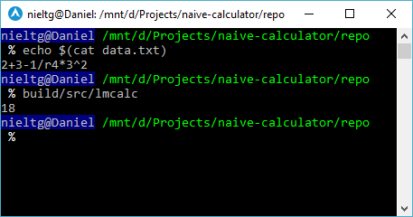

# Naive Calculator (lmcalc)



Naive calculator, more precisely, a simple calculator with some programming constraints as one of Distributed System Laboratory Assistant selection task.

Specified programming constraints:

- Operator -, +, *, /, %, |, ^, & are not allowed.
- Constants and `if` statements are allowed.
- Loop statements are not allowed, expect for reading `data.txt` file.
- Do not declare new variables. (4 variables, each 8 bit)
- Power and square root operations has higher precedence.
- Maximum number input: 3 digits.

This project utilizes extensive uses of macro and intended for **educational purposes only**.

Things you can learn from this project:

- How C/C++ preprocessor handles macros.
- Several ideas about what things can be done with macros.
- Primitive binary addition method using full-adder concept.
- Exponentation by squaring method.
- Two's complement utilization for substraction.
- Binary division using long division method.

## Building

Build dependencies:

- **CMake** version 2.8
- **Ninja** build system

To compile and test:

```sh
./build.sh
```

Create your own `data.txt` or copy sample:

```sh
cp doc/data.txt .
```

To run:

```sh
build/src/lmcalc
```

Program will read `data.txt`, then evaluates arithmetic expression located in the file.

## Architecture

Architecture of this project can be read on [doc/arch.md](doc/arch.md).

Papers, written in Indonesian language:

- [Spesifikasi Tugas.pdf](doc/paper/Spesifikasi%20Tugas.pdf)
- [Dokumentasi Arsitektur.pdf](doc/paper/Dokumentasi%20Arsitektur.pdf)

## Contributor

Naive Calculator (lmcalc) is brought to you by [nieltg](https://github.com/nieltg).

## License

[MIT](LICENSE)

## Additional Resources

- [The C Preprocessor](https://gcc.gnu.org/onlinedocs/cpp/)
- [Binary Number: Addition](https://en.wikipedia.org/wiki/Binary_number#Addition)
- [Exponentation by Squaring](https://en.wikipedia.org/wiki/Exponentiation_by_squaring)
- [Two's Complement](https://en.wikipedia.org/wiki/Two%27s_complement)
- [Long Division: Non-Decimal Radix](https://en.wikipedia.org/wiki/Long_division#Non-decimal_radix)
